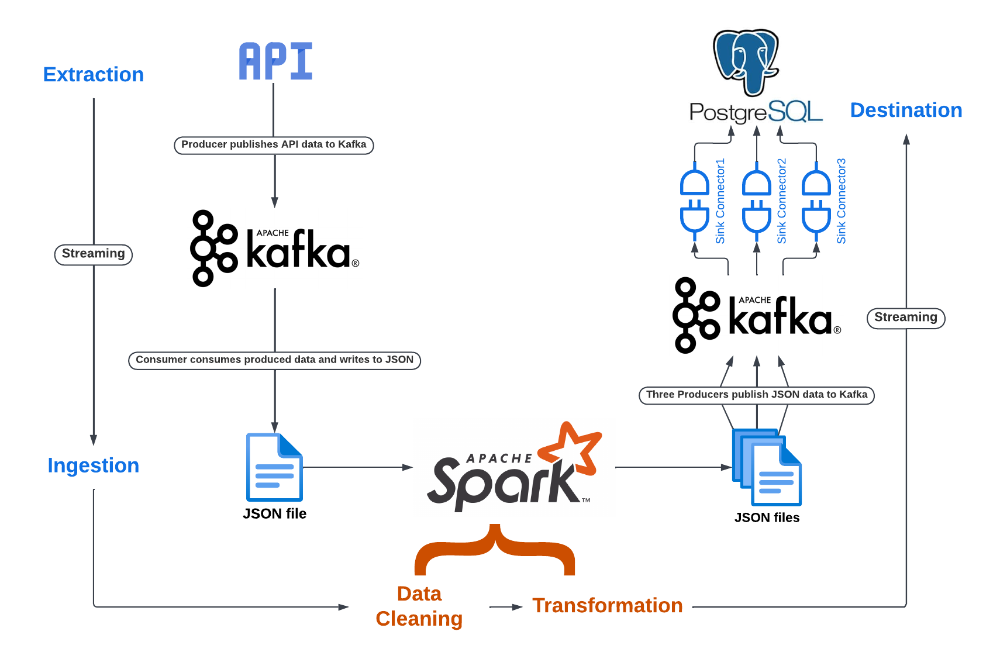

# **Apache Kafka**

This repository consists of codes I used while learning Apache Kafka at Fusemachines Nepal. It consists of a markdown file [`apache_kafka_commands.md`](./apache_kafka_commands.md), that is a guide to relevant Apache Kafka commands. The [`project`](project/) folder consists of a project done in Apache Kafka.

## **Kafka Project**

This project performs analysis on Nobel Laureates data obtained from [Nobel Laureates API](http://api.nobelprize.org/v1/laureate.csv?gender=All), provided by the official Nobel Prize Organization. You can learn more about the API from this [link](https://nobelprize.readme.io/reference/laureate). The pipeline diagram for the Apache Kafka project is shown below:

The pipeline diagram can be explained as follows:

1. **Extraction/Ingestion:**
   Nobel laureates data received from the API published to a topic in Kafka (running locally) by a producer program ([`api_fetch_produce.py`](./project/api_fetch_produce.py)). Consumer program ([`api_consume.py`](./project/api_consume.py)) receives the published data and writes it as [`.json file`](./project/data/laureates_data.json).

2. **Pre-processing/Transformation:**
   The .json file is loaded into Apache Spark and pre-processed, then transformed. This part is done in [`nobel_laureates_spark_analysis.ipynb`](./project/nobel_laureates_spark_analysis.ipynb) The transformed dataframes are again written to three .json files within [`project/data`](./project/data) folder. Cleaned data is also stored there as [`.json`](./project/data/cleaned_data.json).

3. **Destination:**
   The transformed .json outputs are published in 3 different topics of Kafka by making three producers in a [`python program`](./project/pyspark_output_produce.py). The published data is comsumed via sink connector to its final destination i.e. PostgreSQL. [`project/create_sink.py`](./project/create_sink.py) creates sinks. Further three additional consume programs are also located in [`project`](./project/) folder.

## **Running the Project**

1. Download the confluent kafka archive package by using the following command:

```
$ curl -O http://packages.confluent.io/archive/7.3/confluent-7.3.0.tar.gz
```

Extract the confluent folder and place it in your project folder.

2. Install confluent kafka jdbc connector using the command:

```
$ confluent-hub install confluentinc/kafka-connect-jdbc:latest
```

3. Start zookeeper, kafka-server, connect-distributed and schema registry using the following commands in four different terminals:

```
$ zookeeper-server-start <path_to_confluent_folder>/etc/kafka/zookeeper.properties

$ kafka-server-start <path_to_confluent_folder>/etc/kafka/server.properties

$ connect-distributed <path_to_confluent_folder>/etc/kafka/connect-distributed.properties

$ schema-registry-start <path_to_confluent_folder>/schema-registry/schema-registry.properties
```

4. You need to have python3, jupyter notebook and python3-pip installed. To install all required packages run:

```
$ pip install -r requirements.txt
```

5. Run api_fetch_produce.py and api_consume.py, so that the data can be loaded into your [`data`](./project/data) folder:

```
$ python3 project/api_fetch_produce.py

$ python3 project/api_fetch_consume.py
```

6. Run the analysis notebook [`nobel_laureates_spark_analysis.ipynb`](./project/nobel_laureates_spark_analysis.ipynb) in jupyter notebook.

7. Run pyspark_output_produce to publish three output .json files from transformation stage to three kafka topics.

8. Install PostgreSQL, then create a database named `kafka_test` and schema named `kafka_connect`.

9. Change the PostgreSQL username and password credentials in [`create_sink.py`](./project/create_sink.py)

10. Run the [`create_sink.py`](./project/create_sink.py) to create sink connectors to PostgreSQL. If you look in PostgreSQL, you can now see the respective tables.
